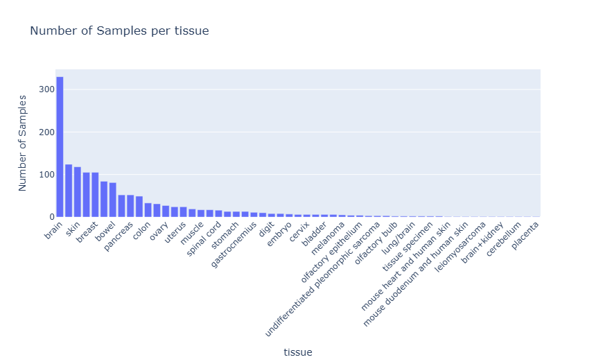

**Pipeline de Prétraitement pour Données de Transcriptomique Spatiale**

Objectif du Projet

Ce projet met en œuvre un pipeline de prétraitement pour des données de transcriptomique spatiale. L'objectif est d'harmoniser et de fusionner différents jeux de données afin de préparer les données pour des analyses en aval, telles que l'entraînement de modèles d'apprentissage automatique.La méthodologie s'inspire des approches de traitement de données à grande échelle, similaires à celles décrites dans l'article "STimage-1K4M: A histopathology image-gene expression dataset for spatial transcriptomics", qui vise à lier des images d'histopathologie à des profils d'expression génique. Ce pipeline fournit une base pour répliquer de telles analyses en assurant la propreté et la cohérence des métadonnées.L'étape actuelle du projet se concentre sur la fusion et le nettoyage des métadonnées. Les étapes de prétraitement des données de transcriptomique seront ajoutées ultérieurement.Distribution des Échantillons par OrganeLa visualisation ci-dessous montre la répartition des échantillons biologiques en fonction de leur organe d'origine dans le jeu de données final.Structure du Projet (en cours). 
